# IoT Predictive Maintenance Workshop

## Intro

Labs summary:

1. On the **CDSW** cluster, train your model with the **Experiment** feature.
2. On the **CDSW** cluster, deploy the model into production with the **Model** feature.
3. On the Gateway host, run a simulator to send IoT sensors data to the MQTT broker.
4. On the Gateway host, run **MiNiFi** to read from the MQTT broker, filter and forward to the **NiFi** cluster.
5. On the NiFi cluster, prepare and send to the **Kafka** cluster.
6. On the CDH cluster, process each record using **Spark Streaming**, calling the **Model endpoint** and save results to **Kudu**.
7. On the CDH cluster, pull reports on upcoming predicted machine failures using **Impala** and **Hue**.

## Lab 0 - Initial setup

1. Create a CDH+CDSW cluster as per instructions [here](https://github.com/fabiog1901/OneNodeCDHCluster).
2. Ensure you can SSH into the cluster, and that traffic from the cluster is only allowed from your own IP/VPN for security reasons.
3. Login into Cloudera Manager, and familiarize youself with the services installed. The URLs to access the other services are:
  - Cloudera Manager: http://public-hostname:7180
  - Cloudera Edge Flow Management: http://public-hostname:10080/efm/ui
  - NiFi: http://public-hostname:8080/nifi/
  - NiFi Registry: http://public-hostname:18080/nifi-registry
  - Hue: http://public-hostname:8888
  - CDSW: http://cdsw.PUBLIC-IP.nip.io   

Login into **Hue**. As you are the first user to login into Hue, you are granted admin privileges. At this point, you won't need to do anything on Hue, but by logging in, CDH has created your HDFS user and folder, which you will need for the next lab. 

Ensure you remember the username and password, as you will use these throughout this workshop.

Below a screenshot of Chrome open with 6 tabs, one for each service.

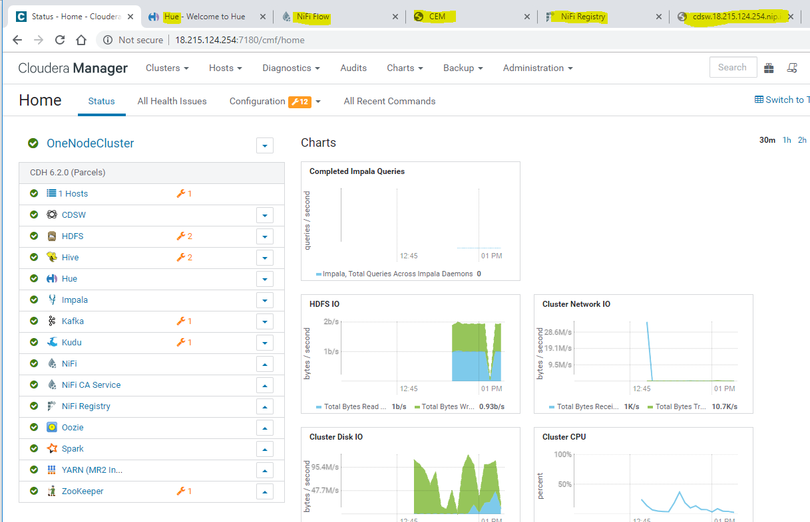

## Lab 1 - CDSW: Train the model

In this and the following lab, you will wear the hat of a Data Scientist. You will write the model code, train it several times and finally deploy the model to Production. All within 30 minutes!

**STEP 0** : Configure CDSW

Open CDSW Web UI and click on *sign up for a new account*. As you're the first user to login into CDSW, you are granted admin privileges.

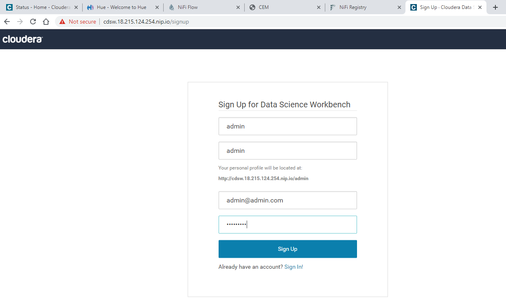

Navigate to the CDSW **Admin** page to fine tune the environment:
- in the **Engines** tab, add in _Engines Profiles_ a new engine (docker image) with 2 vCPUs and 4 GB RAM, while deleting the default engine.
- add the following in _Environmental Variables_: 
   ```
   HADOOP_CONF_DIR = /etc/hadoop/conf/
   ```

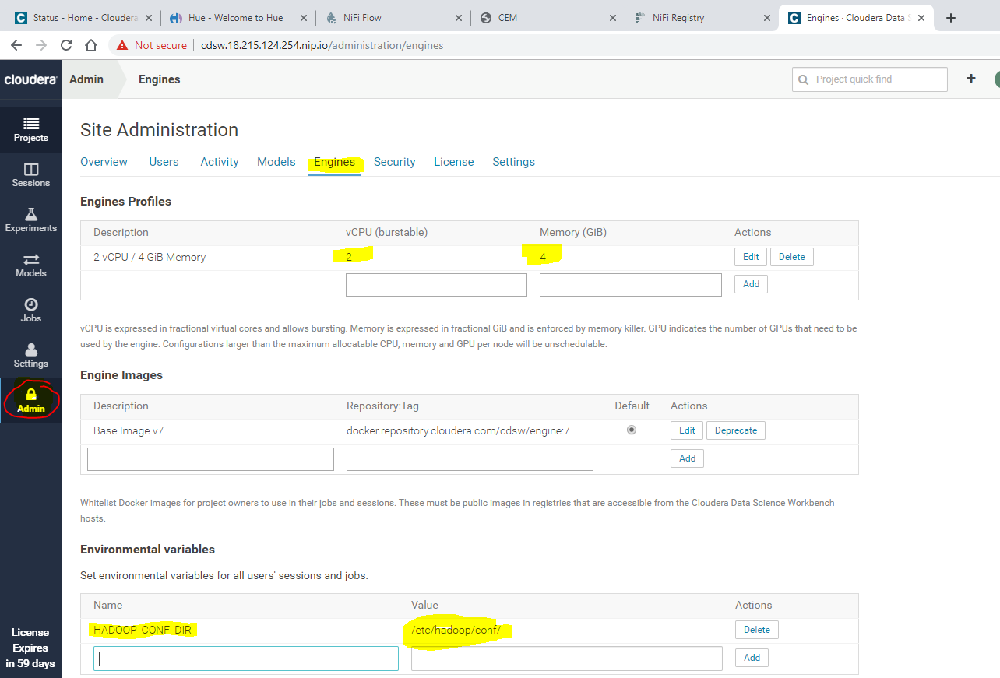


**STEP 1** : Create the project

Return to the main page and click on **New Project**, using this GitHub project as the source.

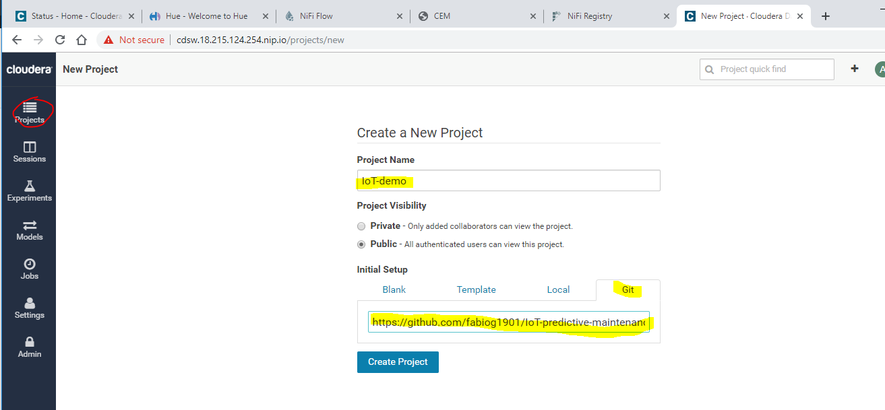

Now that your project has been created, click on **Open Workbench** and start a Python3 Session


Once the Engine is ready, run the following command to install some required libraries:
```
!pip3 install --upgrade pip scikit-learn
```
The project comes with a sample historical data. Copy this dataset into HDFS:
```
!hdfs dfs -put data/historical_iot.txt /user/$HADOOP_USER_NAME
```

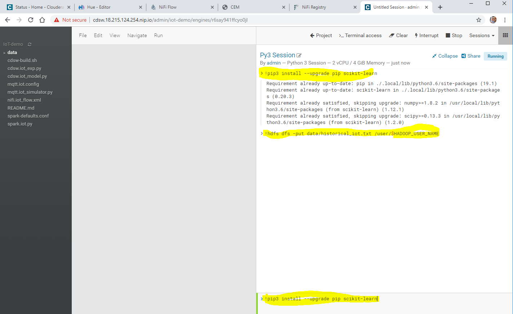

You're now ready to run the Experiment to train the model on your historical data.

**STEP 2** : Examine `cdsw.iot_exp.py`

Open the file `cdsw.iot_exp.py`. This is a python program that builds a model to predict machine failure (the likelihood that this machine is going to fail). There is a dataset available on hdfs with customer data, including a failure indicator field.

The program is going to build a failure prediction model using the Random Forest algorithm. Random forests are ensembles of decision trees. Random forests are one of the most successful machine learning models for classification and regression. They combine many decision trees in order to reduce the risk of overfitting. Like decision trees, random forests handle categorical features, extend to the multiclass classification setting, do not require feature scaling, and are able to capture non-linearities and feature interactions.

`spark.mllib` supports random forests for binary and multiclass classification and for regression, using both continuous and categorical features. `spark.mllib` implements random forests using the existing decision tree implementation. Please see the decision tree guide for more information on trees.

The Random Forest algorithm expects a couple of parameters:

numTrees: Number of trees in the forest.
Increasing the number of trees will decrease the variance in predictions, improving the model’s test-time accuracy. Training time increases roughly linearly in the number of trees.

maxDepth: Maximum depth of each tree in the forest.
Increasing the depth makes the model more expressive and powerful. However, deep trees take longer to train and are also more prone to overfitting. In general, it is acceptable to train deeper trees when using random forests than when using a single decision tree. One tree is more likely to overfit than a random forest (because of the variance reduction from averaging multiple trees in the forest).

In the `cdsw.iot_exp.py` program, these parameters can be passed to the program at runtime, to these python variables:

```
param_numTrees = int(sys.argv[1])
param_maxDepth = int(sys.argv[2])
```

Also note the quality indicator for the Random Forest model, are written back to the Data Science Workbench repository:

```
cdsw.track_metric("auroc", auroc)
cdsw.track_metric("ap", ap)
```

These indicators will show up later in the **Experiments** dashboard.

**STEP 3** : Run the experiment for the first time

Now, run the experiment using the following parameters:
```
numTrees = 20 numDepth = 20
```
From the menu, select `Run -> Experiments`. Now, in the background, the Data Science Workbench environment will spin up a new docker container, where this program will run. You can stop the Engine at this point.

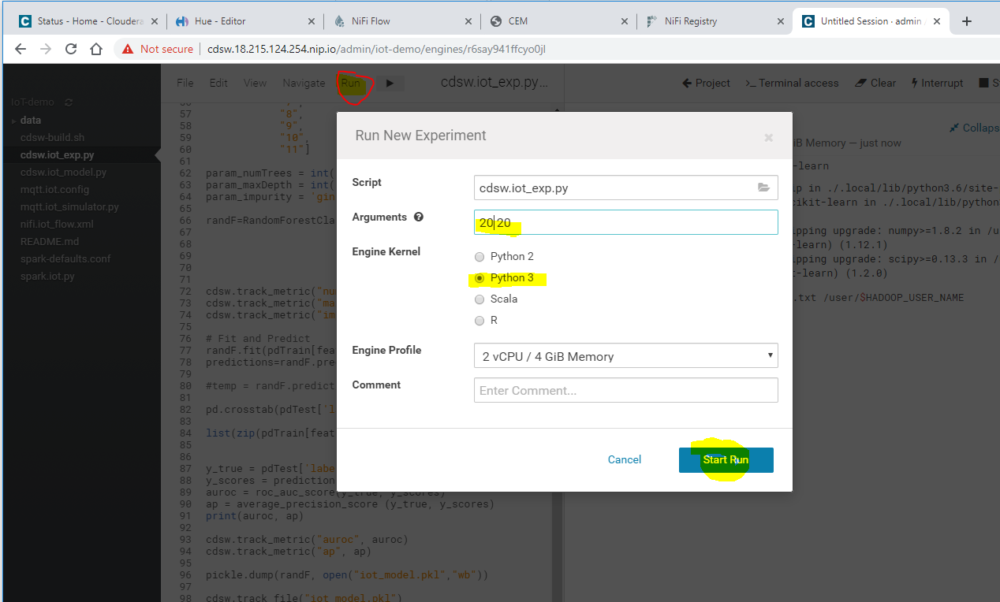

Go back to the **Projects** page in CDSW, and hit the **Experiments** button.

If the Status indicates ‘Running’, you have to wait till the run is completed. In case the status is ‘Build Failed’ or ‘Failed’, check the log information. This is accessible by clicking on the run number of your experiments. There you can find the session log, as well as the build information.

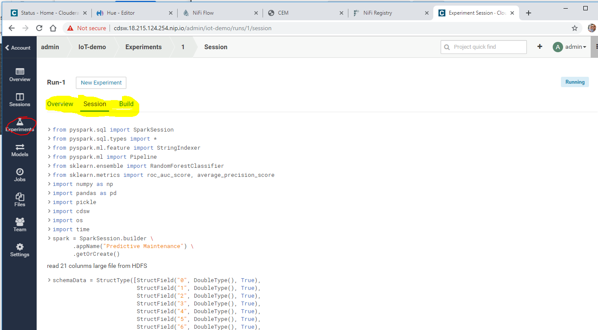

In case your status indicates ‘Success’, you should be able to see the auroc (Area Under the Curve) model quality indicator. It might be that this value is hidden by the CDSW user interface. In that case, click on the ‘3 metrics’ links, and select the auroc field. It might be needed to de-select some other fields, since the interface can only show 3 metrics at the same time.


In this example, ~0.8478. Not bad, but maybe there are better hyper parameter values available.

**STEP 4** : Re-run the experiment several times

Go back to the Workbench and run the experiment 2 more times and try different values for NumTrees and NumDepth. Try the following values:
```
NumTrees NumDepth
15       25
25       20
```
When all runs have completed successfully, check which parameters had the best quality (best predictive value). This is represented by the highest ‘area under the curve’, auroc metric.


**STEP 5** : Save the best model to your environment

Select the run number with the best predictive value, in this case, experiment 2. In the Overview screen of the experiment, you can see that the model in spark format, is captured in the file `iot_model.pkl`. Select this file and hit the **Add to Project** button. This will copy the model to your project directory.

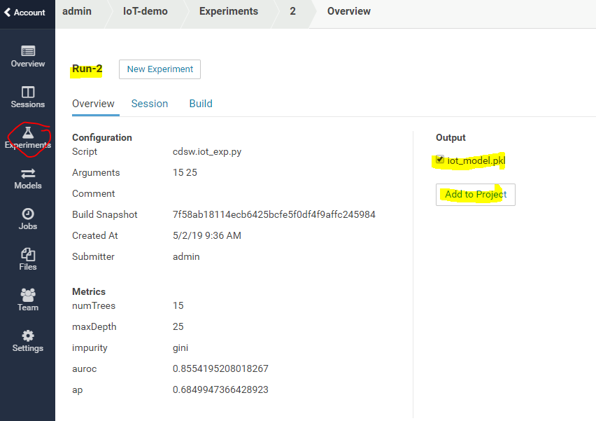
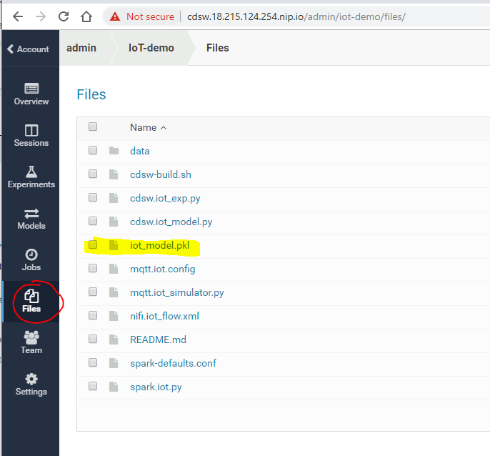

## Lab 2 - CDSW: Deploy the model

**STEP 1** : Examine the program `cdsw.iot_model.py`

Open the project you created in the previous lab, and examine the file in the Workbench. This PySpark program uses the pickle.load mechanism to deploy models. The model it refers to the `iot_modelf.pkl` file, was saved in the previous lab from the experiment with the best predictive model.

There is a predict definition which is the function that calls the model, using features, and will return a result variable.

Before deploying the model, try it out in the Workbench: launch a Python3 engine and run the code in file `cdsw.iot_model.py`. Then call the `predict()` method from the prompt:
```
predict({"feature": "0, 65, 0, 137, 21.95, 83, 19.42, 111, 9.4, 6, 3.43, 4"})
```


The functions returns successfully, so we know we can now deploy the model. You can now stop the engine.

**STEP 2** : Deploy the model

From the projects page of your project, select the **Models** button. Select **New Model** and populate specify the following configuration:

```
Name:	         "IoT Prediction Model"
Description:	 "IoT Prediction Model"
File:		       cdsw.iot_model.py
Function:	     predict	
Example Input: {"feature": "0, 65, 0, 137, 21.95, 83, 19.42, 111, 9.4, 6, 3.43, 4"}
Kernel:		     Python 3
Engine:	       2 vCPU / 4 GB Memory
Replicas:	     1
```

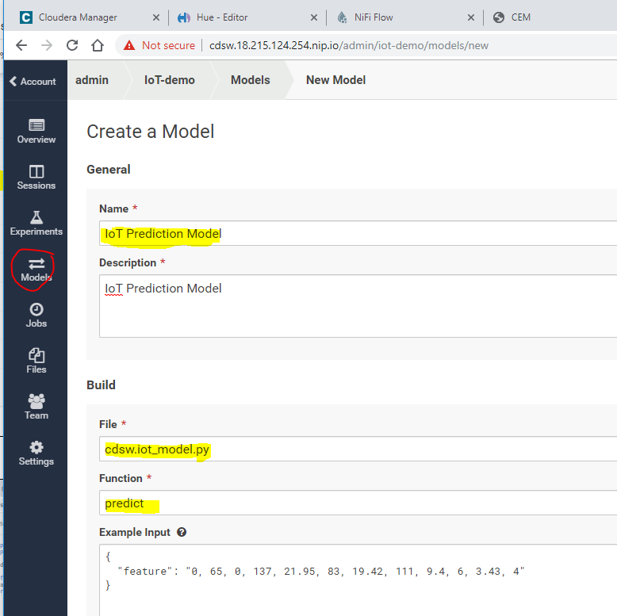

If all parameters are set, you can hit the **Deploy Model** button. Wait till the model is deployed. This will take several minutes.

**STEP 3** : Test the deployed model

After the several minutes, your model should get to the **Deployed** state. Now, click on the Model Name link, to go to the Model Overview page. From the that page, hit the **Test** button to check if the model is working.

The green color with success is telling that our REST call to the model is technically working. And if you examine the response: `{“result”: 1}`, it returns a 1, which mean that machine with these features is likely to stay healthy.

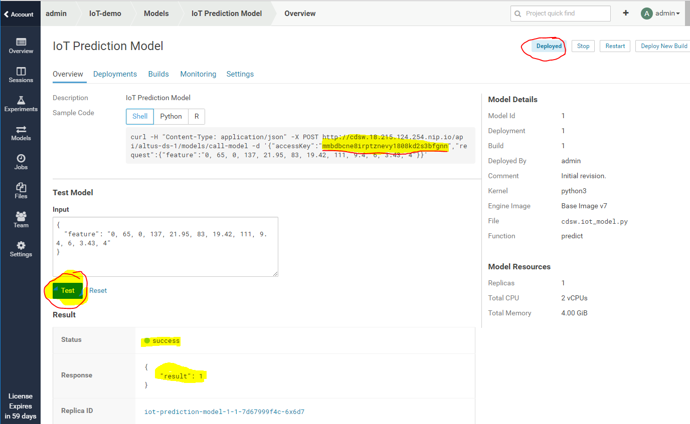

Now, lets change the input parameters and call the predict function again. Put the following values in the Input field:
```
{
  "feature": "0, 95, 0, 88, 26.62, 75, 21.05, 115, 8.65, 5, 3.32, 3"
}
```
With these input parameters, the model returns 0, which mean that the machine is likely to break. Take a note of the **AccessKey** as you will need this for lab 6.


## Lab 3 - Gateway host: setup machine sensors simulator and MQTT broker

In this lab you will run a simple Python script that simulates IoT sensor data from some hypotetical machines, and send the data to a MQTT broker, [mosquitto](https://mosquitto.org/). The gateway host is connnected to many and different type of sensors, but they generally all share the same trasport protocol, mqtt.

SSH into the VM, then install required libs and start the mosquitto broker
```
$ sudo su -
$ yum install -y mosquitto
$ pip install paho-mqtt
$ systemctl enable mosquitto
$ systemctl start mosquitto
```

Now clone this repo, then run the simulator to send sensor data to mosquitto.
```
$ git clone https://github.com/fabiog1901/IoT-predictive-maintenance.git
$ mv IoT-predictive-maintenance/mqtt.* ~
$ python mqtt.iot_simulator.py mqtt.iot.config
```

You should see an output similar to the below:

```
iot: {"sensor_id": 48, "sensor_ts": 1556758787735011, "sensor_0": 2, "sensor_1": 14, "sensor_2": 5, "sensor_3": 43, "sensor_4": 34, "sensor_5": 97, "sensor_6": 29, "sensor_7": 121, "sensor_8": 5, "sensor_9": 2, "sensor_10": 5}
iot: {"sensor_id": 24, "sensor_ts": 1556758797738580, "sensor_0": 1, "sensor_1": 9, "sensor_2": 5, "sensor_3": 46, "sensor_4": 39, "sensor_5": 87, "sensor_6": 51, "sensor_7": 142, "sensor_8": 47, "sensor_9": 4, "sensor_10": 8}
iot: {"sensor_id": 70, "sensor_ts": 1556758807751841, "sensor_0": 2, "sensor_1": 1, "sensor_2": 1, "sensor_3": 48, "sensor_4": 8, "sensor_5": 70, "sensor_6": 15, "sensor_7": 103, "sensor_8": 22, "sensor_9": 1, "sensor_10": 2}
```

You can stop the simulator now, with Ctrl+C.


## Lab 4 - Gateway host: configure and run MiNiFi

MiNiFi is installed in the gateway host. In this lab you will configure and run MiNiFi to read from the mosquitto broker and forward to the NiFi cluster, but it's only in the next lab that you will provide the flow to execute.

Download the NiFi MQTT Processor to read from mosquitto 
```
$ cd ~
$ wget http://central.maven.org/maven2/org/apache/nifi/nifi-mqtt-nar/1.8.0/nifi-mqtt-nar-1.8.0.nar -P /opt/cloudera/cem/minifi/lib
$ chown root:root /opt/cloudera/cem/minifi/lib/nifi-mqtt-nar-1.8.0.nar
$ chmod 660 /opt/cloudera/cem/minifi/lib/nifi-mqtt-nar-1.8.0.nar
```
You can now start the MiNiFi agent
```
$ systemctl start minifi
```
You might want to check the logs to confirm all is good:
```
$ cat /opt/cloudera/cem/minifi/logs/minifi-app.log
```

## Lab 5 - Configuring Edge Flow Management

Cloudera Edge Flow Management gives you a visual overview of all MiNiFi agents in your environment, and allows you to update the flow configuration for each one, with versioning control thanks to the **NiFi Registry** integration. In this lab, you will create the MiNiFi flow and publish it for the MiNiFi agent to pick it up.

Open the EFM Web UI at http://public-hostname:10080/efm/ui. Ensure you see your minifi agent's heartbeat messages in the **Events Monitor**.

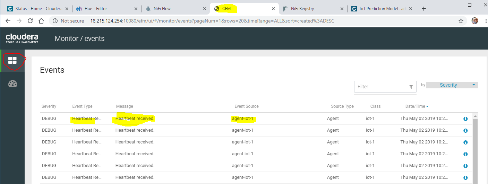

You can then select the **Flow Designer** tab and build the flow. To build a dataflow, select the desired class from the table and click OPEN. Alternatively, you can double-click on the desired class. 

Add a _ConsumeMQTT_ Processor to the canvas and configure it with below settings:
```
Broker URI: tcp://localhost:1883
Client ID: minifi-iot
Topic Filter: iot/#
Max Queue Size = 60
```
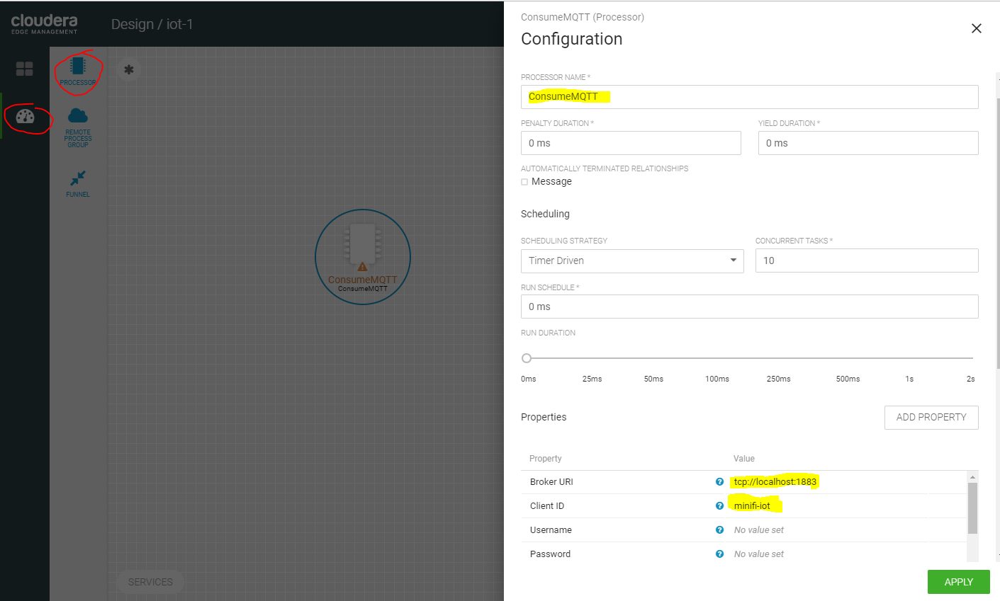

Add a _Remote Process Group_ to the canvas and configure it as follows:
```
URL = http://hostname:8080/nifi
```
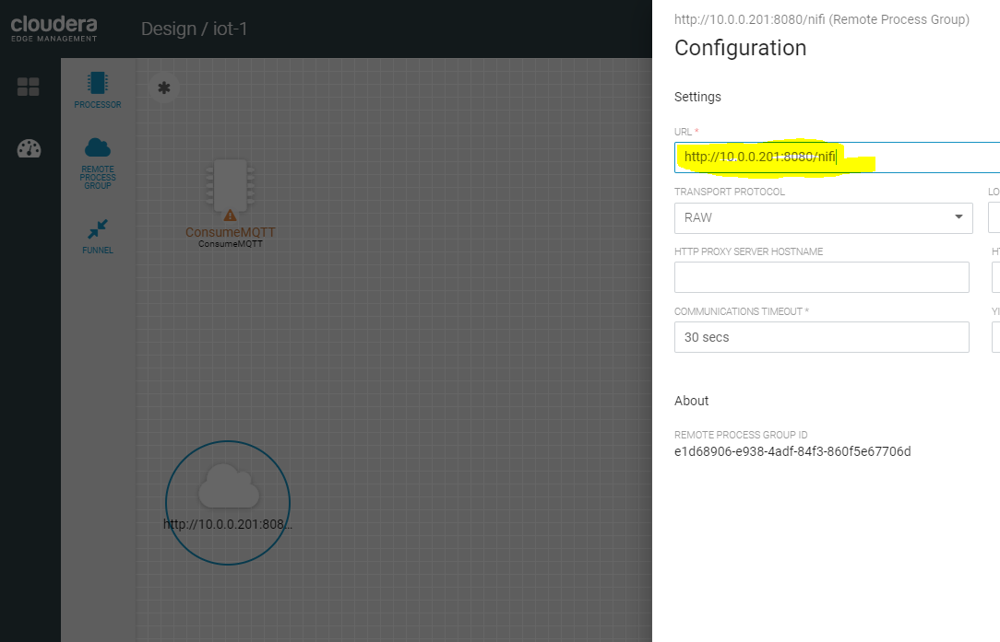


At this point you need to connect the ConsumerMQTT processor to the RPG, however, you first need the ID of the NiFi entry port. Open NiFi Web UI at http://public-hostname:8080/nifi/ and add an _Input Port_ to the convas. Call it something like "from Gateway" and copy the ID of the input port, as you will soon need it. 

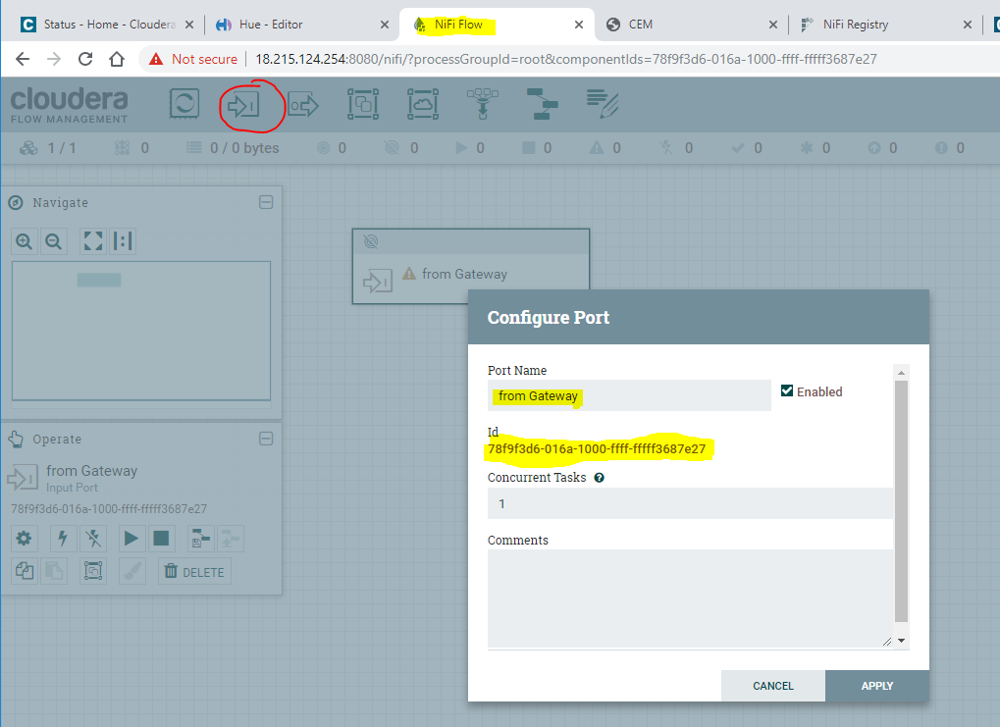

To close the NiFI flow - as it is required -, you can temporarely add a _LogAttribute_ processor, and setup 2 connections:
- from the Input Port to LogAttribute;
- from LogAttribute to itself.

Start the InputPort, but keep the LogAttribute in a stopped state.

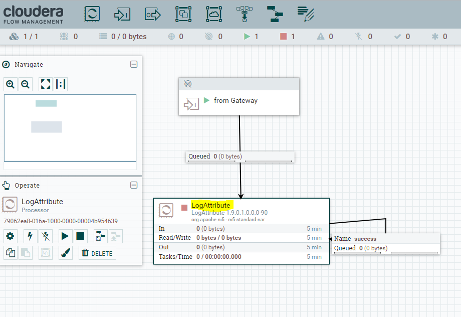

Back to the Flow Designer, connect the ConsumeMQTT to the RPG. The connection requires an ID and you can paste here the ID you just copied.

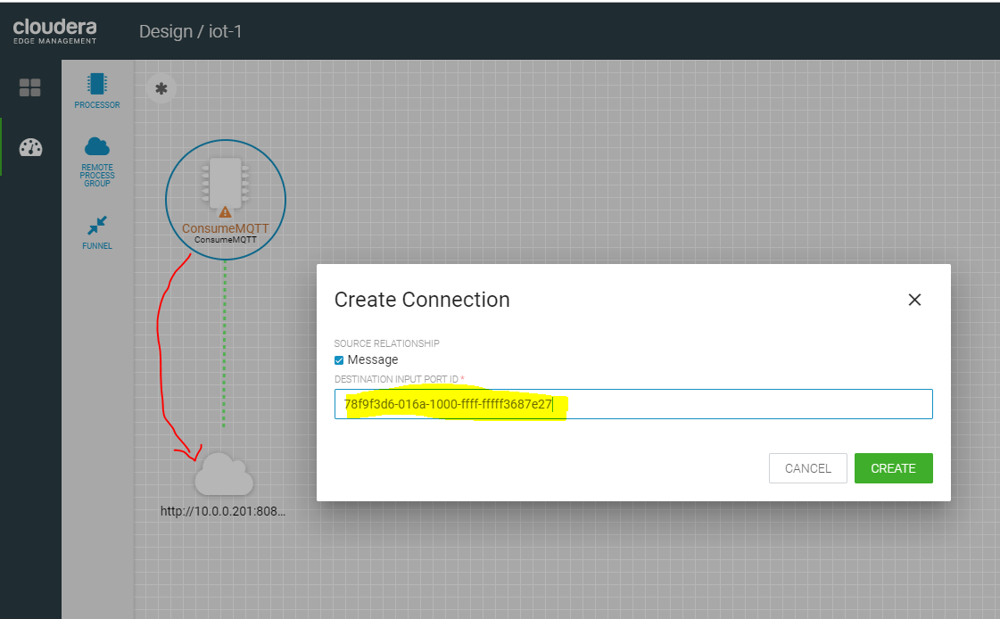

The Flow is now complete, but before publishing it, create the Bucket in the NiFi Registry so that all versions of your flows are stored for review and audit. Open the NiFi Registry at http://public-hostname:18080/nifi-registry and create a bucket called "IoT".

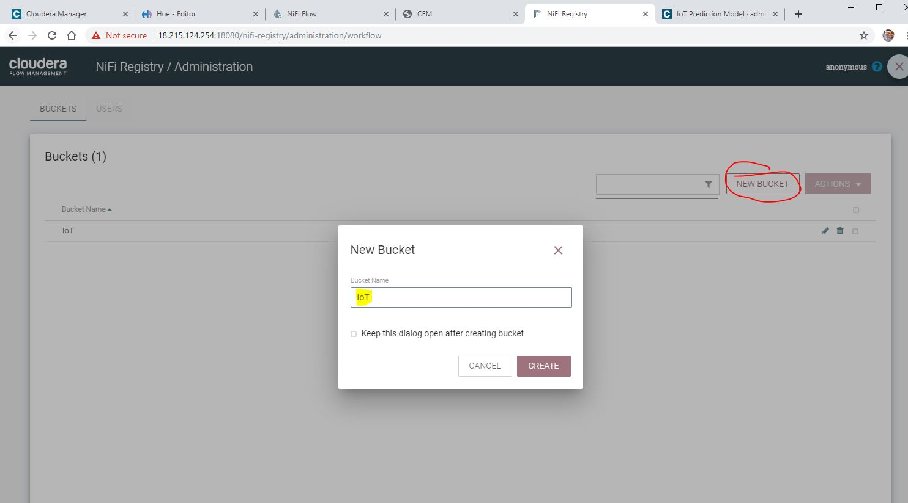

You can now publish the flow for the minifi agent to automatically pick up.

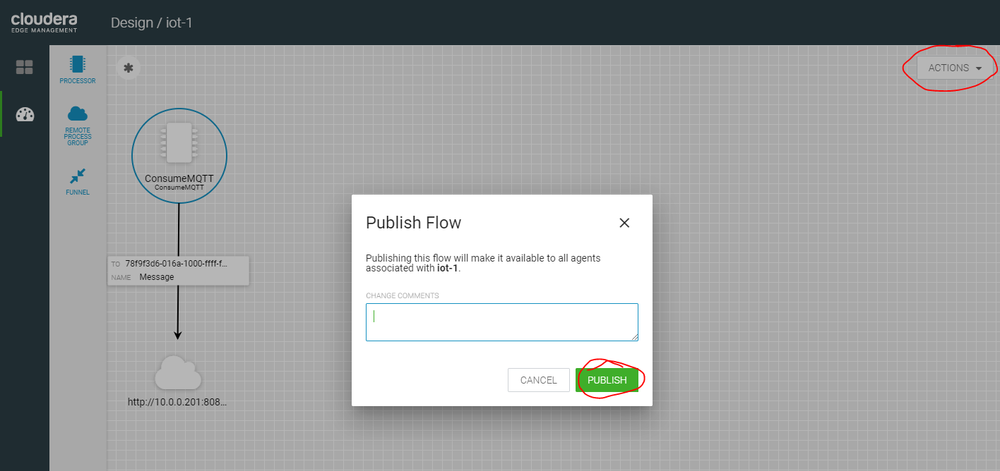

If successful, you will see the Flow details in the NiFi Registry.

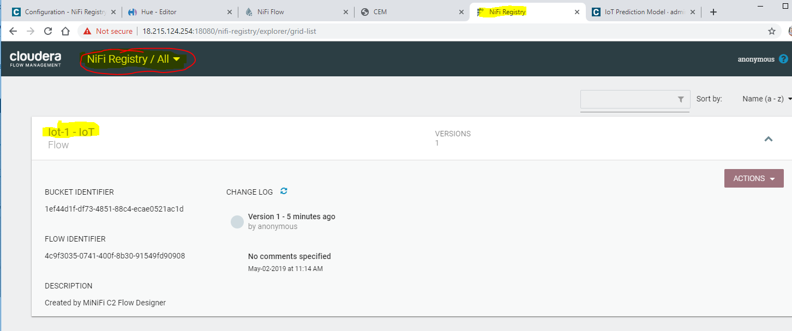

At this point, you can test the edge flow up until NiFi. Start the simulator again and confirm you can see the messages queued in NiFi.
```
$ python mqtt.iot_simulator.py mqtt.iot.config
```

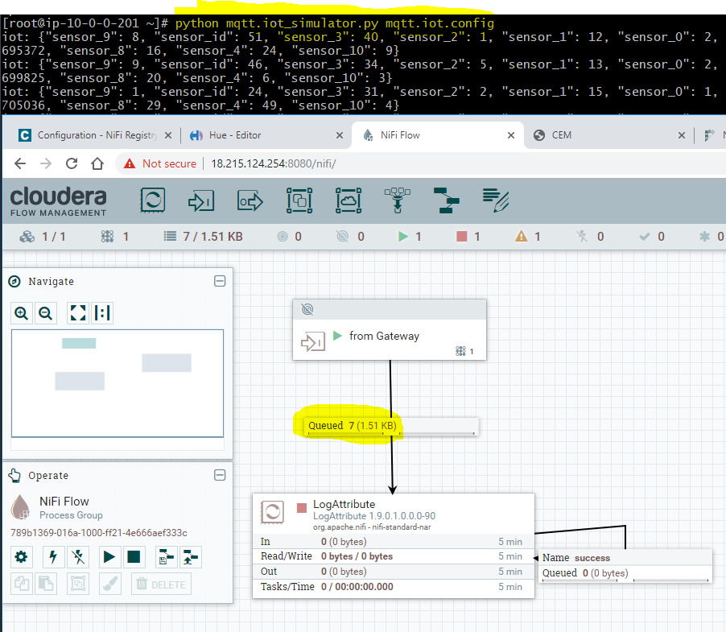


## Lab 6 - Configuring the NiFi flow and push to Kafka

In this lab, you will create a NiFi flow to receive the data from all gateways and push it to **Kafka**. 

Open the NiFi web UI and add a _PublishKafka_2.0_ processor and configure it as follows:

```
Kafka Brokers: <hostname>:9092
Topic Name: iot
Use Transactions: False
```

Connect the Input Port to the PublishKafka processor by dragging the destination of the current connection from the LogAttribute to the PublishKafka. As with the LogAttribute, create a connection from the PublishKafka to itself. Then you can start the Kafka processor.

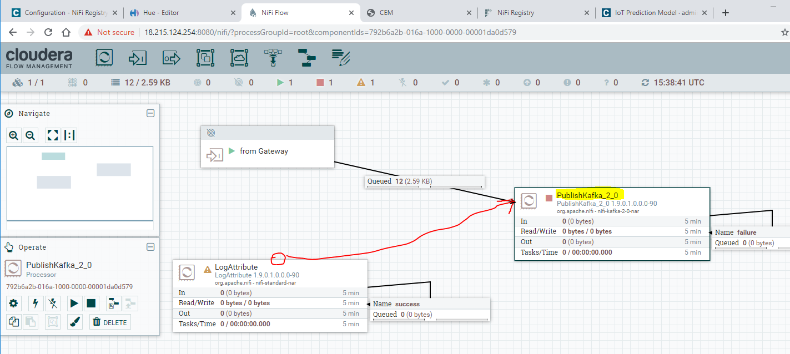

You can add more processors as needed to process, split, duplicate or re-route your FlowFiles to all other destinations and processors.

## Lab 7 - Use Spark to call the model endpoint and save to Kudu 

Spark Streaming is a processing framework for (near) real-time data. In this lab, you will use Spark to consume Kafka messages which contains the IoT data from the machine, and call the model API endpoint to predict whether, with those IoT values the machine sent, the machine is likely to break. Then save the results to Kudu for fast analytics.

First, create the Kudu table. Login into Hue, and in the Impala Query, run this statement:

```
CREATE TABLE sensors
(
 sensor_id INT,
 sensor_ts TIMESTAMP, 
 sensor_0 DOUBLE,
 sensor_1 DOUBLE,
 sensor_2 DOUBLE,
 sensor_3 DOUBLE,
 sensor_4 DOUBLE,
 sensor_5 DOUBLE,
 sensor_6 DOUBLE,
 sensor_7 DOUBLE,
 sensor_8 DOUBLE,
 sensor_9 DOUBLE,
 sensor_10 DOUBLE,
 sensor_11 DOUBLE,
 is_healthy INT,
 PRIMARY KEY (sensor_ID, sensor_ts)
)
PARTITION BY HASH PARTITIONS 16
STORED AS KUDU
TBLPROPERTIES ('kudu.num_tablet_replicas' = '1');
```

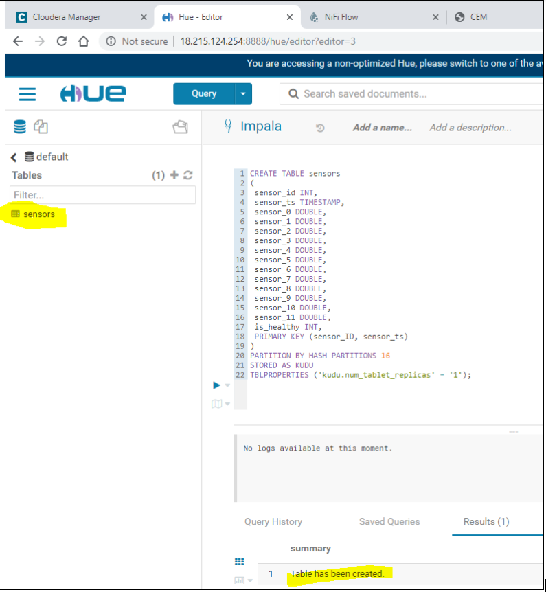

Now you can configure and run the Spark Streaming job. You need here the CDSW Access Key you saved in Lab 2.

Open a second Terminal and SSH into the VM. The first is running the sensor data simulator, so you can't use it.

```
$ cd ~
$ ACCESS_KEY=<put here your cdsw model access key>
$ PUBLIC_IP=`curl https://api.ipify.org/`
$ mv ~/IoT-predictive-maintenance/spark.iot.py ~
$ sed -i "s/YourHostname/`hostname -f`/" spark.iot.py
$ sed -i "s/YourCDSWDomain/cdsw.$PUBLIC_IP.nip.io/" spark.iot.py
$ sed -i "s/YourAccessKey/$ACCESS_KEY/" spark.iot.py
$ wget  http://central.maven.org/maven2/org/apache/kudu/kudu-spark2_2.11/1.9.0/kudu-spark2_2.11-1.9.0.jar
$ wget https://raw.githubusercontent.com/swordsmanliu/SparkStreamingHbase/master/lib/spark-core_2.11-1.5.2.logging.jar
$ rm -rf ~/.m2 ~/.ivy2/
$ spark-submit --master local[2] --jars kudu-spark2_2.11-1.9.0.jar,spark-core_2.11-1.5.2.logging.jar --packages org.apache.spark:spark-streaming-kafka_2.11:1.6.3 spark.iot.py
```

Spark Streaming will flood your screen with log messages, however, at a 5 seconds interval, you should be able to spot a table: these are the messages that were consumed from Kafka and processed by Spark. YOu can configure Spark for a smaller time window, however, for this exercise 5 seconds is sufficient.


## Lab 8 - Fast analytics on fast data with Kudu and Impala

In this lab, you will run some SQL queries using the Impala engine. You can run a report to inform you which machines are likely to break in the near future.

Login into Hue, and run the following statement in the Impala Query

```
select sensor_id, sensor_ts from sensors where is_healthy = 0;
```

Run a few times a SQL statement to count all rows in the table to confirm the latest inserts are always picked up by Impala. This allows you to build real-time reports for fast action.

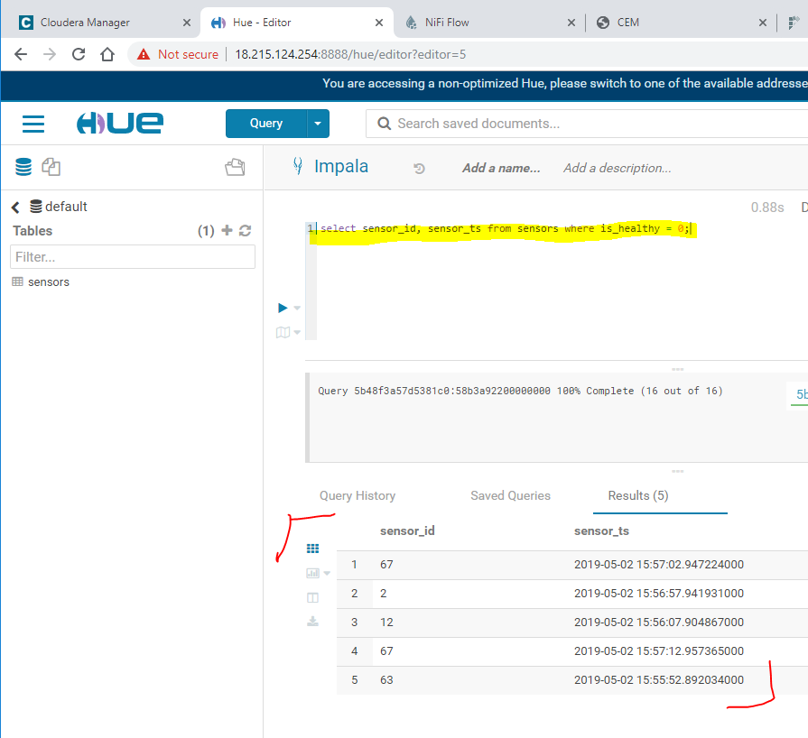

## Appendix
<details>
  <summary>Resources</summary>
  
  [Cloudera Documentation](https://www.cloudera.com/documentation.html)
</details>

## Troubleshooting

### CEM doesn't pick up new NARs
Delete the agent manifest manually using the EFM API:

Verify each class has the same agent manifest ID:
```
http://hostname:10080/efm/api/agent-classes
[{"name":"iot1","agentManifests":["agent-manifest-id"]},{"name":"iot4","agentManifests":["agent-manifest-id"]}]
```

Confirm the manifest doesn't have the NAR you installed
```
http://hostname:10080/efm/api/agent-manifests?class=iot4
[{"identifier":"agent-manifest-id","agentType":"minifi-java","version":"1","buildInfo":{"timestamp":1556628651811,"compiler":"JDK 8"},"bundles":[{"group":"default","artifact":"system","version":"unversioned","componentManifest":{"controllerServices":[],"processors":
```

Call the API
```
http://hostname:10080/efm/swagger/ 
```
Hit the `DELETE - Delete the agent manifest specified by id` button, and in the id field, enter `agent-manifest-id`
